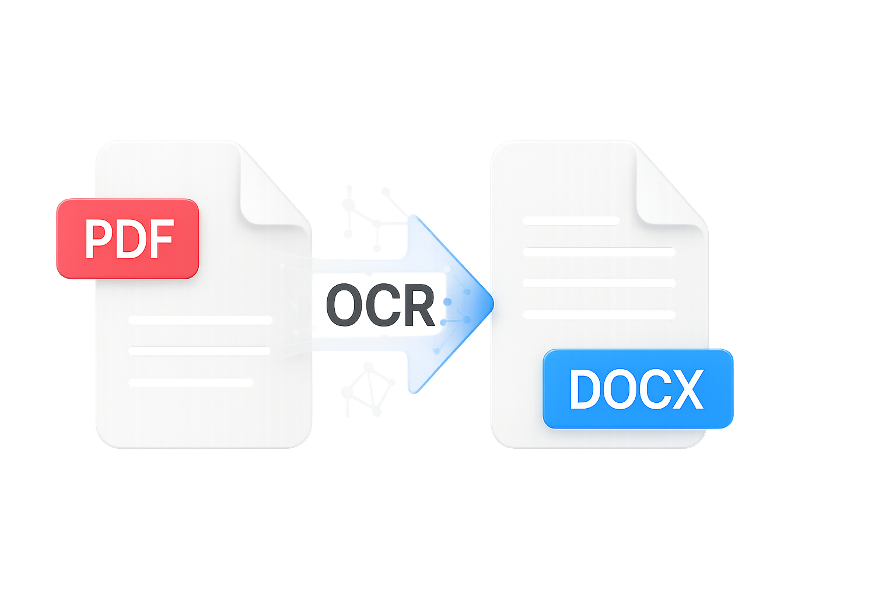

# Konwerter PDF -> DOCX/TXT z OCR

Zaawansowany, wieloplatformowy konwerter PDF na DOCX/TXT z automatycznym rozpoznawaniem tekstu (OCR) dla skanów i zdjęć. Nowoczesny, stabilny interfejs, wsparcie dla macOS, Windows, Linux.

## Najważniejsze funkcje
- Automatyczne rozpoznawanie tekstu (OCR) dla PDF-ów bez warstwy tekstowej (skany, zdjęcia)
- Zaawansowany preprocessing obrazu: autokontrast, wyostrzanie, mocniejsza binarizacja, DPI x3
- Rozpoznawanie wyłącznie języka polskiego dla lepszej skuteczności OCR
- Nowy, stabilny i responsywny interfejs (Tkinter, PanedWindow, podgląd PDF)
- Przycisk "Pomoc / O programie" na górze panelu
- Pasek postępu, logi, anulowanie konwersji, wsparcie dla wielu plików
- Obsługa macOS, Windows, Linux

## Zrzuty ekranu

### Główny interfejs aplikacji
Nowoczesny, czytelny interfejs z panelem wyboru plików, opcjami konwersji i podglądem logów.


### Motyw ciemny
Przełączanie między motywem jasnym a ciemnym dla komfortu pracy w różnych warunkach oświetleniowych.


### Proces konwersji w toku
Pasek postępu i szczegółowe logi w czasie rzeczywistym pokazują postęp konwersji z rozpoznawaniem OCR.


### Zakończona konwersja z logami
Kompletne informacje o zakończonej konwersji z podsumowaniem przetworzonych plików.


## Instalacja
1. Zainstaluj wymagane biblioteki:
   ```bash
   pip3 install -r requirements.txt
   ```
2. Zainstaluj Poppler i Tesseract OCR:
   - **macOS:**
     ```bash
     brew install poppler tesseract tesseract-lang
     ```
   - **Windows:**
     - Pobierz Poppler: https://github.com/oschwartz10612/poppler-windows/releases
     - Pobierz Tesseract: https://github.com/tesseract-ocr/tesseract
   - **Linux:**
     ```bash
     sudo apt install poppler-utils tesseract-ocr tesseract-ocr-pol
     ```

## Uruchomienie
```bash
python3 app.py
```

## Nowości w wersji 4.2.0 (19.06.2025)
- **NOWY DESIGN**: nowoczesny interfejs w stylu macOS z obsługą motywu dzień/noc
- **DOSTĘPNOŚĆ**: wysoki kontrast i czytelność dla lepszej użyteczności
- **STABILNOŚĆ**: pełna kompatybilność z macOS, Windows i Linux
- **PRODUKCJA**: gotowość do publikacji z pełną dokumentacją
- Wszystkie funkcje z wersji 4.1.0: zaawansowane logowanie, konfiguracja, testy CI/CD

## ENTERPRISE FEATURES

- Zaawansowane logowanie do pliku z rotacją (`logs/app.log`)
- Konfiguracja przez plik `config.yaml` (output_dir, log_level, ocr_lang)
- Automatyczne testy jednostkowe (pytest, katalog `tests/`)
- Gotowy workflow CI/CD (GitHub Actions: `.github/workflows/python-app.yml`)

### Testy automatyczne

Aby uruchomić testy lokalnie:

```bash
pip3 install pytest pyyaml
pytest tests/
```

Testy uruchamiają się automatycznie przy każdym pushu do gałęzi `main` na GitHubie.

### Konfiguracja

Edytuj plik `config.yaml`, aby zmienić domyślne ustawienia aplikacji (np. katalog wyjściowy, poziom logowania, język OCR).

### Logowanie

Wszystkie logi audytowe zapisywane są do pliku `logs/app.log` z automatyczną rotacją (5 plików po 2MB).

## Status projektu

🎯 **Wersja**: 4.2.0 Enterprise Edition  
📅 **Ostatnia aktualizacja**: 19 czerwca 2025  
✅ **Status**: Stabilny, gotowy do użycia produkcyjnego  
🔧 **Testy**: Automatyczne CI/CD z GitHub Actions  
📊 **Kompatybilność**: macOS, Windows, Linux  

## Licencja
MIT

## Autor
Alan Steinbarth
